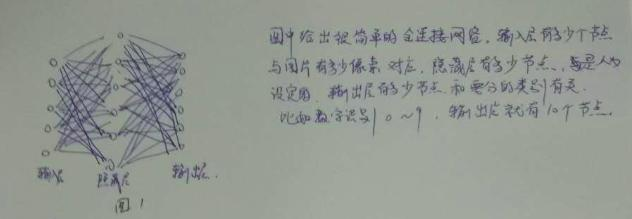
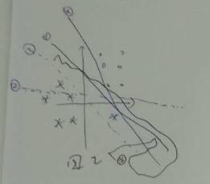
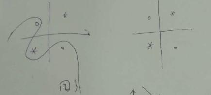
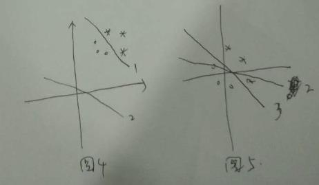

我本科学物理的，后来学的软件，学软件呢还学的java。所以编程基础不是很扎实。确定来寒武纪实习后，开始看的神经网络的知识，也没深入看，又看了些操作系统的知识。只是看新来的一些同学，对这些了解的太少，为便于大家尽快参与工作，也算给我大韦哥交差，不至于太坑他，写了这个文档，希望大家指正。    
### 通俗版神经网络    
当我最初了解神经网络能识别手写数字、识别图像中物体的类别的时候，我十分感慨，这是什么黑科技，怎么做到的。    
后来了解的多了一些，发现它本质上就是基于现在超强的计算能力，利用大的样本（大数定理：样本足够大时，频率收敛于概率。），足够多的参数（我感觉参数多的有些冗余了都），强行刻画一个概率分布。当你输入一张测试图片时，就根据这些参数，给出图中是什么物体的概率。    
假设数字识别问题有个224*224*1的图片（为什么是224呢，我也不知道，好多中网络都是用的这个数字。为什么是1呢，这个是因为彩色图片是三种颜色RGB的混合，而我这里描述的是灰度图片，只需要一个通道），分别对应图片的高度、宽度、通道数，也就是h,w,c。为了和多张图片时描述一致，我用4维数组bool pic[1][224][224][1]，也就是nhwc这4个维度(为什么用bool只能取值0,1来描述呢，就是因为取值少，便于我分析，实际的图片应该是0～255的取值)来描述这个图片。假设某个特定的像素pic[0][i][j][0]，神经网络会告诉你这个像素如果取值为1，那么图片中的数字可能是1的得分5,可能是2的得分是3,图片中可能是3的得分是12，...；如果这个像素取值为0，那么图片中的数字可能是1的得分2,可能是2的得分是11,图片中可能是3的得分是1，...。这样综合所有的像素点，就会给出这个图片是1的概率是多少，是2的概率是多少...。你可能会问，这个是得分呀老哥，怎么成概率了呢？这个很简单，你在需要确定是数字几的时候，只需要知道一个相对值高低就行，比如1的得分比其他数字都高，那它就是1了，这个概率可以通过softmax函数变换一下得到，这个变换不会改变相对值的高低，只是让得分的取值映射到了[0,1]这个区间而已。    
    
上面的打分是怎么打的呢？非常简单就是z=w*x+b,然后再f(z)，这里的f是非线性函数，在神经网络中有个专用的名词叫做激活函数，为什么要用这个非线性函数，我后面会解释。上图中每条线上都隐含着w和b。这就是神经网络中的参数。    
w,和b是怎么得到的呢？这就是神经网络厉害的地方了，它自己学习的。举个简单的线性可分的二分类问题。如图2。    
    
图中圆圈和星星代表两类。首先随机生成w和b,画出一条线，比如说就是线2。然后神经网络发现这条线不对，就调整了一下这条线，比如说调整到了线3。发现是不大行，继续调整，一直调整到可以正确分类，比如说线1。神经网络是如何发现线2不对的呢，这个是在训练神经网络的时候，需要人给个label，这个label是图片的正确分类，就是中央钦定了这张图片是1，那张图片是2。神经网络的预测结果就和这个label对比，判断w和b给出的线对不对。为了量化这条线对不对，定义了代价函数C(w,b)=(y-a)^2。y是神经网络预测的结果，a是label。这种通过代价函数确定线对不对，然后在调整参数的概念叫做反向传播。接下来又有问题，怎么调整参数？是用的梯度下降的方法。这个方法是啥呢，我描述不清楚。反正对于入门大家知道神经网络的训练就是正向预测一下分类，和label对不一下对不对，再调整参数。    
当我真正需要预测图片中是数字几的时候，就没有label了（如果有label,我就不需要神经网络来预测了。）后面的什么和label对比，调整参数通通不需要了，当然你没有label这些也不能做。但有一种情况就是，我要测试一下我训练的这些参数到底行不行的时候，我先用神经网络算一算，看神经网络给出什么结果，再和正确的label对比，看一下神经网络的正确率是多少。  
回到图1,为什么需要隐藏层呀？这个原因有很多，conv层可以给出图片相邻元素之间互相关系的信息；pooling层可以减少参数个数，也在模仿了人类视觉的看远方物体时特征提取有关（这里学计算物理的时候有个名词，叫啥来着想不起来了）。但我认为加入隐藏层最初的目的是引入更多的参数，更多的参数，以为着你有更多的自由度，可以刻画概率更精细。老哥等等，刚才还说pool是为了减少参数，这咋又成了引入更多的参数了。pooling减少参数，是相当于别的类型的层来说的。多加了一层，当然是参数增加了，而且这里的减少参数也是在整个网络参数已经够多的情况下减少的。    
#### 激活函数  
激活函数f为什么要用非线性函数呢？这是因为如果整个计算过程中，只有线性信息，你网络层数再多最终也只能刻画线性函数，引入了非线性意味着可以解决更多的问题。图3中的圈和星星用直线无论如何都做不到分类的。    
  
如果只是线性函数，假设第一层的输出是y1=w1*x+b1,则第二层的输出是y2=w2*y1+b2=w2*w1*x+w2*b1+b2还是线性的。对于使用了非线性激活函数为什么可以模拟任何形状的函数，大家可以联想一下微积分中使用泰勒展开时的思想。再举个简单的例子。以阶跃函数为例$\epsilon(t-1)+\epsilon(t-2)-2\epsilon(t-3)=\epsilon(t-1)-\epsilon(t-2)+2\epsilon(t-2)-2\epsilon(t-3)$就简单地模拟一个曲段，设想如果更平滑更细致一些，非线性函数可以模拟一切曲线。   
  
这几天老师给我分配了一个任务，没写，思路有点断。   
#### 一些骚操作   
减均值：为什么要减去均值呢，从熵的角度看，减去均值并没有提供什么额外的信息。从物理学中的平移不变性来看，你甚至会感觉这个毫无作用。实际上呢，这个操作是为了加快训练。假设多个单通道，两个像素的图片，这样我用两个坐标就可以描述一张图片，如图4所示。由于图片中的像素值都是大于0的，所以图片都在第一向限。假设对这些图片正确的分类曲线是线1,由于初始化权值时，一般是按照正态分布初始化（这个我没有考证），所以初始化曲线一般是在原点附近，例如2。如果减去均值，如图5。正确的线由1平移到了3。我们发现线2和线3之间的差别比线2和线1的差别小，这样训练的速度会快一些。  
  
标准化：就是概率论中的减去均值再除以标准差。为什么要这个操作，一方面由于正态分布的特殊性质，建议阅读正态分布的前世今生这个文章，写的非常好。什么特殊性质呢，老实说我也不太懂，我感觉是由于正态分布比较稳定，加上微扰依然能保持自己是正态分布。还有我觉得是出于精度的考虑。y=w*x+b，如果x的绝对值减小，w的有效位数就可以高一些。  
正则化：注意图一中的线1和线4,理论上没有任何理由认为这两条线哪个更好，同理，注意线5,对，就是那个弯弯曲曲的线，理论上也是没有任何理由认为线5比线1和线4差。但是呢，有个奥卡姆剃刀原理，就是简单有效原理，因为线1和线4比线5简单，所以认为这两条线更好。是不是感觉很没有道理。我也感觉没啥道理。其实呢，物理学中也有这种简单有效原理，为什么牛顿的力学解释天体运动，比各种本轮圈圈套圈圈更有说服力，当然了现在我们知道是因为质量造成空间弯曲（这个说法不一定严谨，我也不清楚还有什么更普遍的解释），从理论本身的角度来看，也是牛顿的解释更加简单。扯远了险些忘了正题。理论上来说更多的参数，比较少的参数可以更好地完成分类任务。可是为什么有的时候网络层数加深，效果反而变差了呢？因为层数加深，网络难以训练了。为什么难以训练了呢，大家可以查一查梯度消失和梯度爆炸。我好像不能解释正则化了，还是要学习一个。强行引入正则化吧。大家查一查L2正则化，简单来说就是希望更少的参数，更小的参数。  
稀疏化，宋新开同学讲过了，讲的很好。简单来说就是去掉一些不重要的参数，减少计算量和减轻过拟合。  
我怎么越写越感觉自己不该写这个东西，我写不了。  
总而言之，神经网络训练过程中有过拟合、梯度消失、梯度爆炸的问题。有好多复杂的手段改善这些问题。  
  
动态链接库：可能确实有同学不知道为什么要总是设置export LD_LIBRARY_PATH=....大家可以查查动态链接库的概念。顺便再学习一个c++中include文件，和python中import的规则和顺序。    
  
那个好心人帮我调整一下格式。我好像没怎么有时间了。    
  
其实呢上面的这些和我真正想写的没什么联系，不了解深度学习的看看了解了解，至少知道自己是在做什么。    
  
#### 关爱大韦哥  
我前几天帮大韦哥做了一些微小的工作。什么工作呢，这是我的正题。    
首先第一步：编出动态链接库，大家可以学习一个makefile,cmake,bazel的知识了，我为啥不写呢，给你们一个学习的机会，好吧，其实我也不太懂。  
第二步：设置好export LD_LIBRARY_PATH=...。接下来关注我跑的一个classification可执行文件。这个文件依赖那些库呢，libipu.so,libcaffe.so，可能还有别的库。  
第三步：为classification准备参数。我怎么知道需要那个参数呢？运行一下试试./classification看看提示不提示。如果提示，恭喜你。如果不提示，咋整，没好办法，问同学。可是大韦哥好忙，而且问同学好麻烦，咋办呀，看源代码，一般main函数做的第一件事就是解析参数，读读main函数就知道需要那些参数了。到这里先停一下，不妨分析分析这个文件classification是干啥的。想一下神经网络的工作方式，就知道需要一个网络结构文件，权值文件，图片文件，还有为了加快训练使用的均值文件，按说这些就行了，为了使输出结果更加容易看懂，需要一个分类程序给出的数字对应的字符串类别文件，就是synset_words.txt。为了统计正确率还需要一个图片正确的标签文件。其余的就是指定在哪个设备上跑，debug输出什么信息的参数了。  
  
  
  
  
  
  
  
  
  

