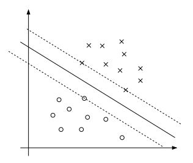
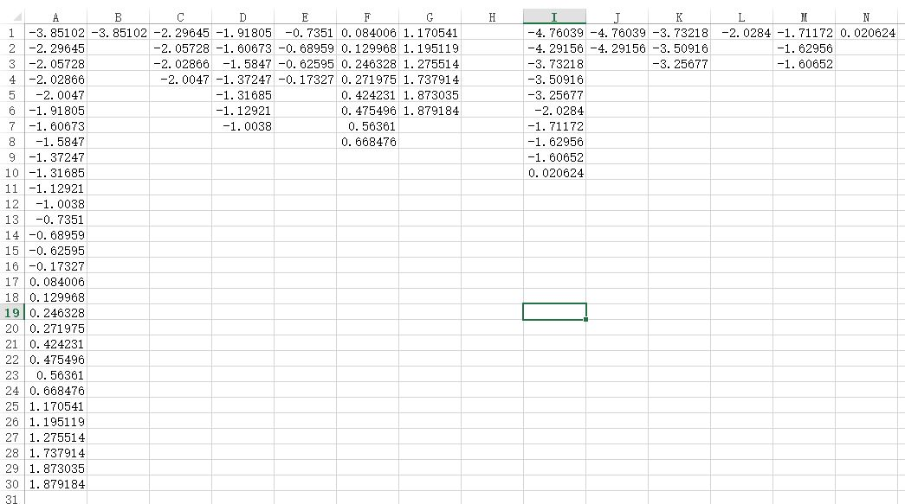
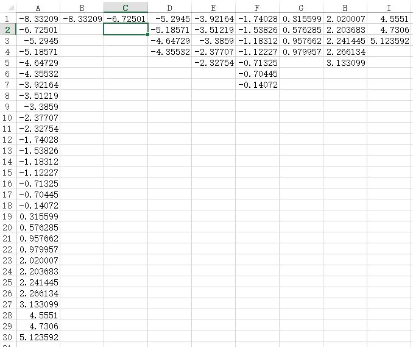
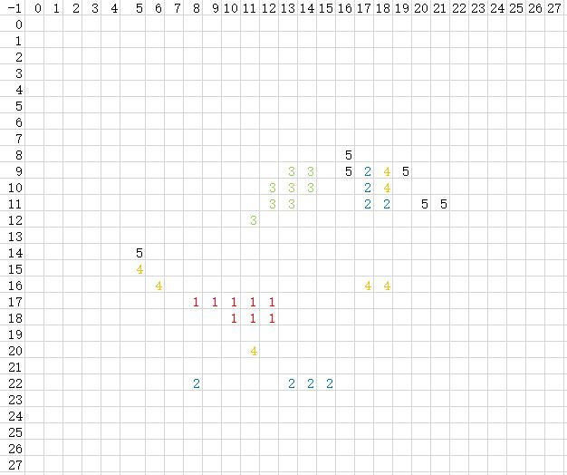

在学习Michael Nielsen著的[Neural Networks and Deep Learning](http://neuralnetworksanddeeplearning.com/index.html)神经网络与深度学习的第一章的时候的一些感谢与疑惑。    
使用的代价函数是$$C(w,b)\equiv \frac{1}{2n}\sum_x\mid\mid y(x)-a\mid\mid^2$$
相信不少同学看到这个公式的时候，和我一样最先想到是最小二乘法。但是又不知道它拟合的是哪条直线。    
最小二乘法是在线性回归中学到的，它最本质的原因是$P(y^{(i)}|x^{(i)})$在给定x的情况下，y的测量值服从正态分布（中心极限定理），作为对观察值的极大似然估计，导出了最小二乘法。详细的可见吴恩达的[机器学习课程](http://cs229.stanford.edu/materials.html)。   
但是这次要讨论的代价函数，与最小二乘法没什么关系，事实上在第三节中将代价函数换成了交叉熵。   
     
如果不考虑最后的sigmoid函数，并且只考虑两层全连接神经网络，则可以写成$z=w_{i}x_{i}$这是一个线性方程从$R^n \rightarrow R$的映射，那么它映射的结果是什么呢？    
以判断这个输入的手写字是否为6为例，如果是输入的是数字6，这个映射输出的很大可能是一个大于0的数字，并且算法会尽量输出大的数。如果是输入的不是数字6，这个映射输出的很大可能是一个小于0的数字，并且算法会尽量输出小的数。这样再经过S型函数后给出的将是手写数字是6的概率。    
熟悉几何的同学可能观察到，$z=w_{i}x_{i}$也可以看成是$R^{n+1}$维空间钟的一个超平面，又结合这是个分类问题，很自然地联想到支持向量机中用超平面来区分类。那么这里的超平面也是用来区分类的吗？    
答案是否定的。至少不是中的这条直线。事实上这里用于划分的超平面是$z=0$。    

我之前认为sigmoid函数仅仅是一个$R \rightarrow (0,1)$的映射，两层的全连接神经网络这样理解是没问题的。但是对于多层的神经网络这样理解就有问题了。sigmoid是个非线性函数，这是模拟一切曲线曲面的根源。以阶跃函数为例$\epsilon(t-1)+\epsilon(t-2)-2\epsilon(t-3)=\epsilon(t-1)-\epsilon(t-2)+2\epsilon(t-2)-2\epsilon(t-3)$就简单地模拟一个曲段，设想如果更平滑更细致一些，非线性函数可以模拟一切曲线。    
对一个三层的神经网络，第二层的某个神经元先是一个$R^n \rightarrow R$的映射$z=w_{i}x_{i}$，又是一个$R \rightarrow (0,1)$的映射$a=\sigma(z)$；第三层的某个神经元先是一个$(0,1)^m \rightarrow R$的映射$z^\prime=w^\prime_i*a_i$，又是一个$R \rightarrow (0,1)$的映射$a^\prime=\sigma(z^\prime)$。这里就不好从几何的角度解释了，直接看映射关系更直接。事实上几何与代数结合的目的就是为了解决几何中难以想象的地方。
      
试了一下均匀分布和泊松分布，权重和偏移全为正值的时候，训练毫无作用。正确率是10%左右，且无论怎么改学习率都不行。     
有正有负的均匀分布(-2,2)效果倒是挺好的。学习率为3，迭代10次，（并没有学习到最佳）可以达到95%的正确率。    
      
初始偏移为正态分布训练后的结果     
      
初始偏移为均匀分布训练后的结果     
上面两幅图倒是有相似之处，但有什么必然的联系吗？     
         

梯度下降法，与导数为0时取得最小值之间有什么联系？梯度下降直观的想法找的是w，但更本质的是通过找导数为0的点找到的w，当导数为0的时候，w变得稳定了。    
还有一些疑惑是，中间的隐藏层是检查什么的?     
      
描绘了对于数字0的检测影响最大的5个隐藏层神经元中，检测的是哪个位置（检测哪个位置是通过权重大小判断的）。     
     

为什么会自动收敛，它和马尔科夫链有什么关系吗？      
      

隐藏层的各个神经元从拓扑上看是对称，为什么训练出来的参数有区别？
从拓扑上看并不是完全对称的，最基本就是初始值不同。但x的分布又是怎样影响w和b的分布的呢？     
